

 
 

# 서비스 소개

 
‘산너머’는 등산을 하고 싶은 사용자에게 맞춤형 등산로 정보를 제공하는 서비스입니다.
 
산너머와 함께, 건강한 등산 라이프를 즐겨봐요!
 
 

['산너머' 소개영상 바로가기](https://youtu.be/xhqs7YYi4vc)

 
 
 

# 프로젝트 소개

 
SSAFY 8기 특화 프로젝트 우수상 🏆
 
개발 기간: 2023/02/20 ~ 2023/04/07 (7주)
 
 
김소정(PM, BE) 이연희(FE) 류제엽(FE) 
 
오의석(BE, CI/CD) 윤수희(BE) 김지현(BE)

 
 
 

# 기술 스택

 

 

 

 
 
 

# 아키텍쳐

 
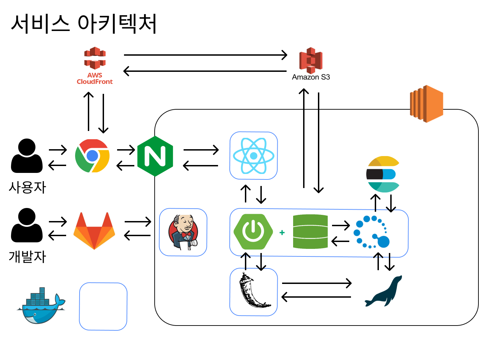

 
 
 

# 프로젝트 특징

 

`🚩 (1) 산너머만의 등산로 리스트 추출 프로그램 제작`

 
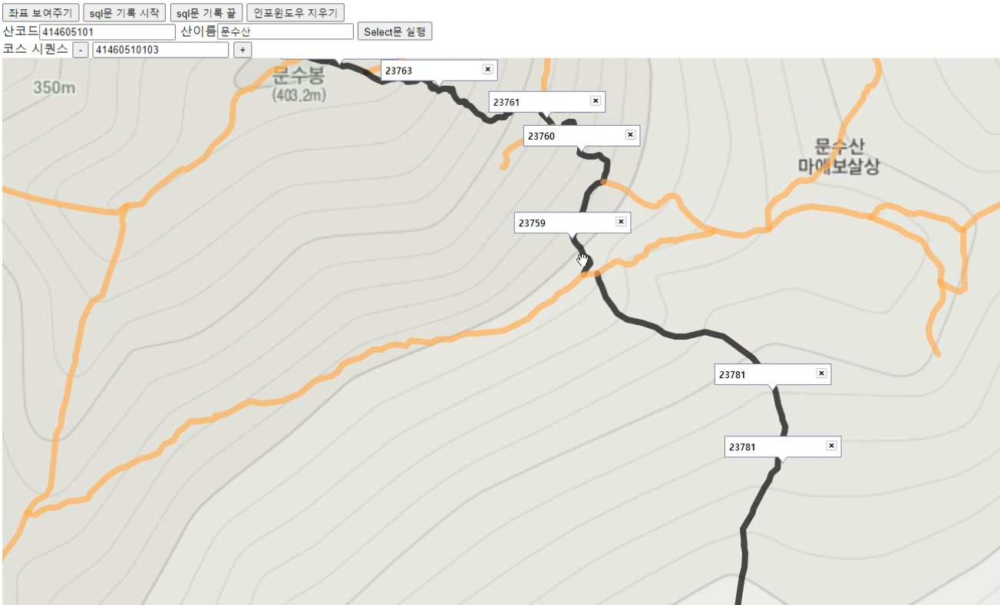

산림청 API에서 받아온 끊어져 있는 등산 경로 데이터를 연결하기 위해
 
카카오 지도 api를 활용하여 **등산 경로를 시각화**하고 
클릭하여 연결하면 **sql문을 생성**하는 프로그램을 추가 구현하여 사용했습니다.

[경로 추출 프로그램 자세히 보기](/data/Create-Course-Program/README.md)

 
 

`🚩 (2) 카카오 지도 API를 활용한 등산로 경로/고도 시각화`

  
 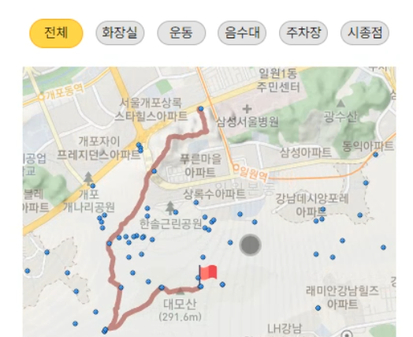

 카카오 지도 API를 활용하여 해당하는 등산로의 경로 데이터를 보여주고,  
 해당하는 등산로의 고도 정보를 Chart.js를 사용하여 시각화하였습니다.

  
  

 `🚩 (3) 추천 알고리즘`

 
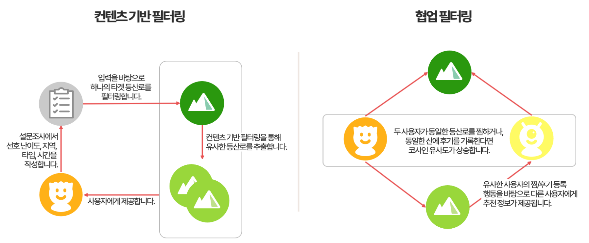

설문조사에를 작성하면 정보를 바탕으로 하나의 타겟 등산로를 필터링합니다.  
이후 컨텐츠 기반 필터링을 통해 유사한 등산로를 추출하고, 사용자에게 제공합니다.  

협업 필터링은 사용자들의 후기와 찜 작성 행위를 기반으로 유사도를 계산하고,  
유사한 사용자의 관심사를 사용자에게 반영합니다.

 
 
 

# 주요 화면

|        |        |
| ------ | ------ |
|    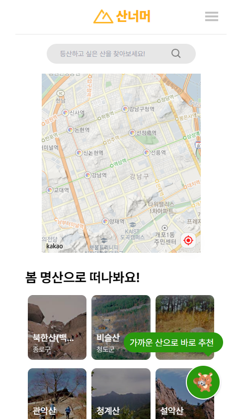     |    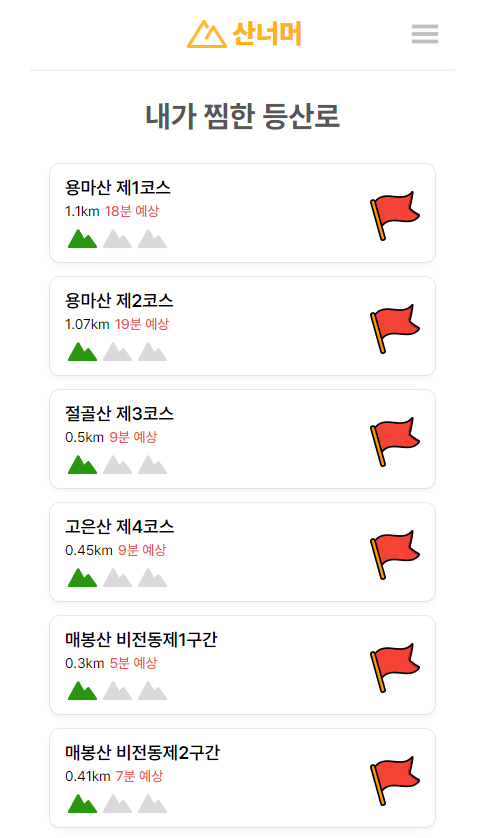     |
|    
 `메인 화면` 
    |    
 `찜리스트` 
    |
|    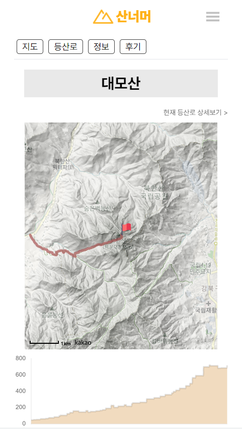    |    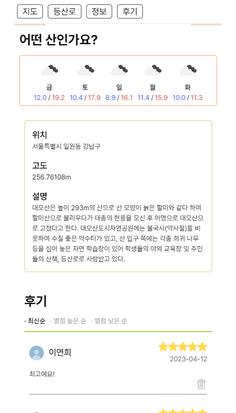    |
|    
 `산 상세 페이지 1` 
    |    
 `산 상세 페이지 2` 
    |
|    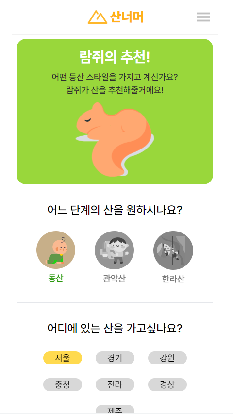    |    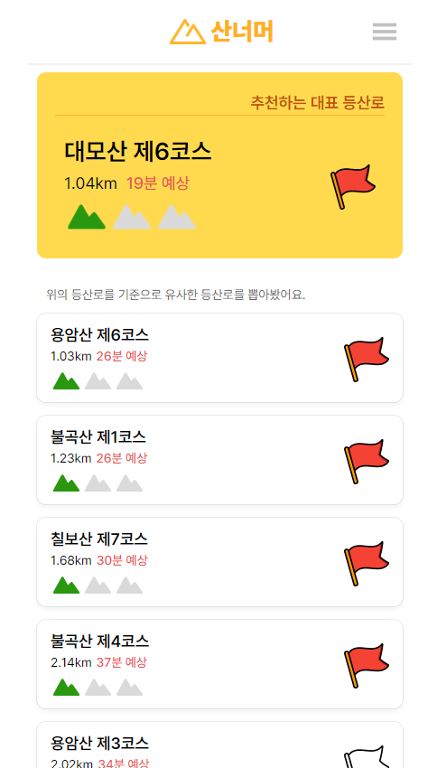    |
|    
 `추천 설문 페이지` 
    |    
 `추천 결과` 
    |
|    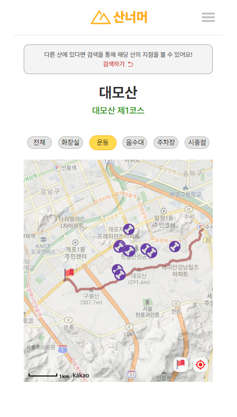    |    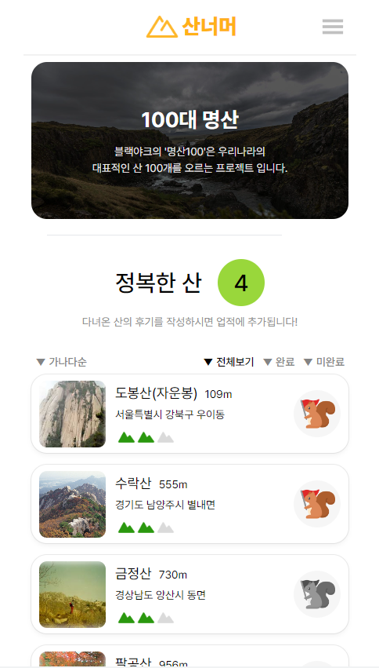    |
|    
 `등산로 스팟 페이지` 
    |    
 `100대 명산` 
    |

 
 
 

# ERD 다이어그램

 

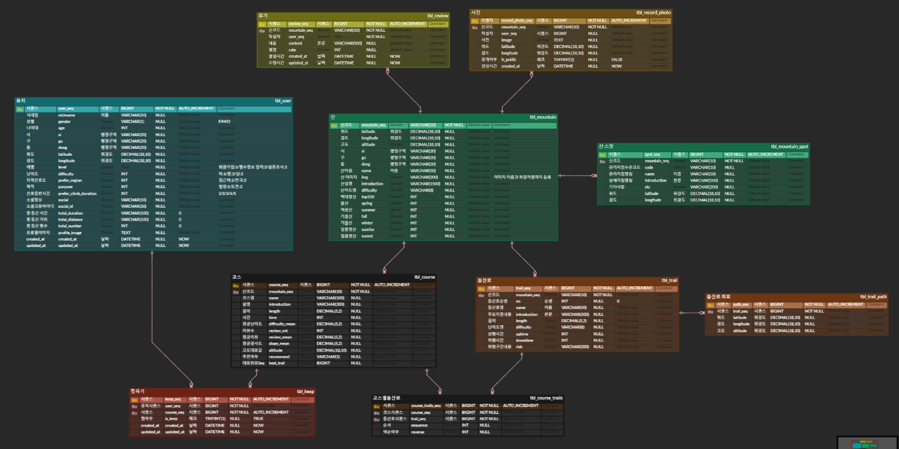

