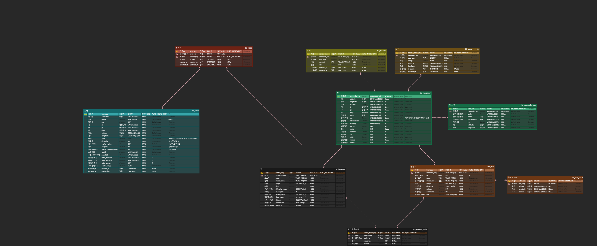
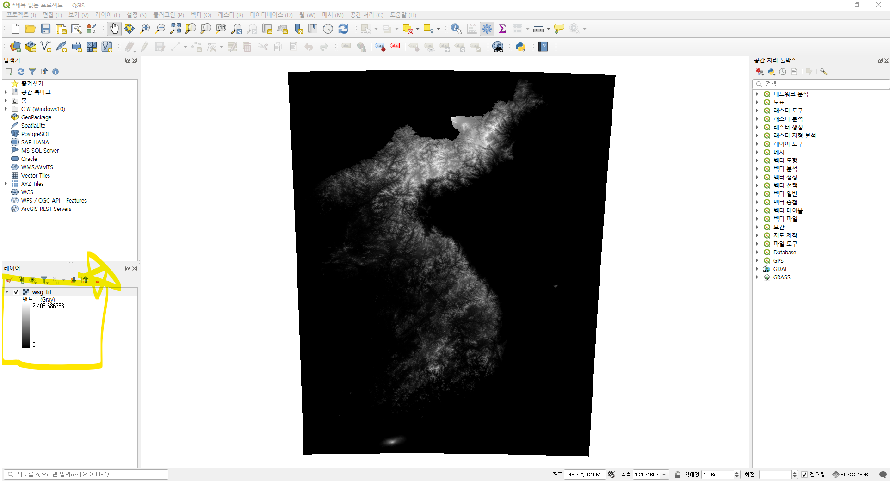
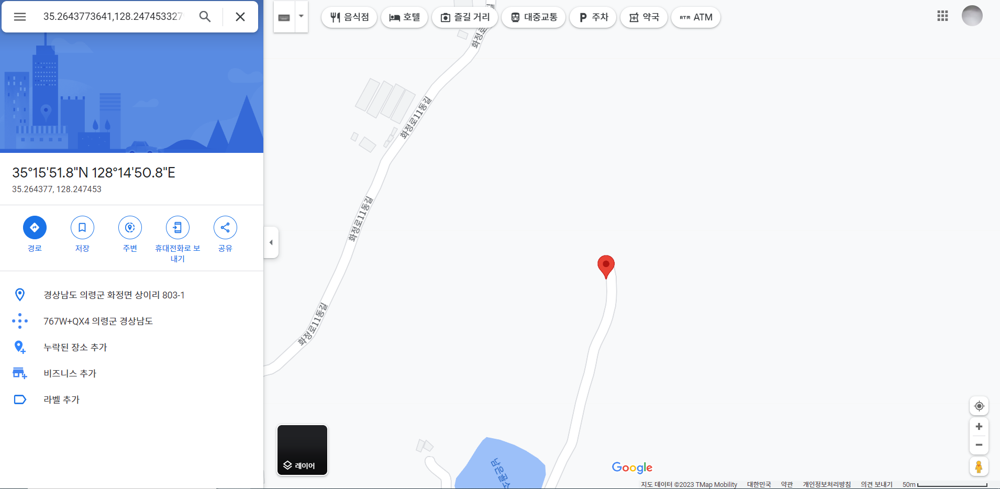

    
    

    
 
    <h2 style="border-bottom: 1px solid #d8dee4; color: #282d33;">  소개</h2>  
    
 저희는 사용자 정보를 기반으로 알맞은 산과 등산로를 추천합니다.
등산에 필요한 정보를 제공함으로써, 개인의 등산 경험을 정리하고 등산 경험을 이끌어 냅니다. 
 
    

    
 
    <h2 style="border-bottom: 1px solid #d8dee4; color: #282d33;"> 개발환경</h2>  
    
 
✔ OS : Window 10

✔ IDE :
&nbsp;&nbsp;&nbsp;&nbsp;◾ IntelliJ
&nbsp;&nbsp;&nbsp;&nbsp;◾ VSCode
&nbsp;&nbsp;&nbsp;&nbsp;◾ HeidiSQL
&nbsp;&nbsp;&nbsp;&nbsp;◾ VIM

✔ Database :
&nbsp;&nbsp;&nbsp;&nbsp;◾  DBMS: Mariadb 10.3.38
&nbsp;&nbsp;&nbsp;&nbsp;◾  SearchEngine: ElasticSearch 8.6.2

✔ Server: AWS EC2

✔ OS: Ubuntu 20.04 LTS (Focal Fossa)

✔ File Server: AWS S3

✔ CI/CD: Jenkins, Docker, Nginx
 
    

    
 
    <h2 style="border-bottom: 1px solid #d8dee4; color: #282d33;">상세기술</h2>  
    
✔ Front-End
&nbsp;&nbsp;&nbsp;&nbsp;◾ axios : 1.3.4
&nbsp;&nbsp;&nbsp;&nbsp;◾ chart.js : 4.2.1
&nbsp;&nbsp;&nbsp;&nbsp;◾ css-loader : 6.7.3
&nbsp;&nbsp;&nbsp;&nbsp;◾ eslint : 8.36.0
&nbsp;&nbsp;&nbsp;&nbsp;◾ eslint-config-airbnb : 19.0.4
&nbsp;&nbsp;&nbsp;&nbsp;◾ eslint-config-airbnb-typescript : 17.0.0
&nbsp;&nbsp;&nbsp;&nbsp;◾ eslint-config-prettier : 8.7.0
&nbsp;&nbsp;&nbsp;&nbsp;◾ eslint-plugin-prettier : 4.2.1
&nbsp;&nbsp;&nbsp;&nbsp;◾ lint : 0.8.19
&nbsp;&nbsp;&nbsp;&nbsp;◾ lottie-react : 2.4.0
&nbsp;&nbsp;&nbsp;&nbsp;◾ node-sass : 8.0.0
&nbsp;&nbsp;&nbsp;&nbsp;◾ prettier : 2.8.5
&nbsp;&nbsp;&nbsp;&nbsp;◾ react : 18.2.0
&nbsp;&nbsp;&nbsp;&nbsp;◾ react-chartjs-2 : 5.2.0
&nbsp;&nbsp;&nbsp;&nbsp;◾ react-dom : 18.2.0
&nbsp;&nbsp;&nbsp;&nbsp;◾ react-icons : 4.8.0
&nbsp;&nbsp;&nbsp;&nbsp;◾ react-kakao-maps-sdk : 1.1.7
&nbsp;&nbsp;&nbsp;&nbsp;◾ react-redux : 8.0.5
&nbsp;&nbsp;&nbsp;&nbsp;◾ react-router-dom : 6.9.0
&nbsp;&nbsp;&nbsp;&nbsp;◾ react-scripts : 5.0.1
&nbsp;&nbsp;&nbsp;&nbsp;◾ react-slick : 0.29.0
&nbsp;&nbsp;&nbsp;&nbsp;◾ redux : 4.2.1
&nbsp;&nbsp;&nbsp;&nbsp;◾ redux-saga : 1.2.3
&nbsp;&nbsp;&nbsp;&nbsp;◾ sass-loader : 13.2.0
&nbsp;&nbsp;&nbsp;&nbsp;◾ slick-carousel : 1.8.1
&nbsp;&nbsp;&nbsp;&nbsp;◾ style-loader : 3.3.1
&nbsp;&nbsp;&nbsp;&nbsp;◾ swiper : 9.2.0
&nbsp;&nbsp;&nbsp;&nbsp;◾ tailwindcss : 3.2.7
&nbsp;&nbsp;&nbsp;&nbsp;◾ typescript : 4.9.5
&nbsp;&nbsp;&nbsp;&nbsp;◾ v6 : 0.0.0
&nbsp;&nbsp;&nbsp;&nbsp;◾ web-vitals : 2.1.0 

✔ Back-End
&nbsp;&nbsp;&nbsp;&nbsp;◾ spring-boot-starter-web
&nbsp;&nbsp;&nbsp;&nbsp;◾ spring-boot-starter-security
&nbsp;&nbsp;&nbsp;&nbsp;◾ spring-boot-starter-oauth2-client
&nbsp;&nbsp;&nbsp;&nbsp;◾ spring-boot-starter-data-jpa
&nbsp;&nbsp;&nbsp;&nbsp;◾ mariadb-java-client
&nbsp;&nbsp;&nbsp;&nbsp;◾ lombok
&nbsp;&nbsp;&nbsp;&nbsp;◾ springfox-swagger-ui:3.0.0
&nbsp;&nbsp;&nbsp;&nbsp;◾ querydsl-jpa
&nbsp;&nbsp;&nbsp;&nbsp;◾ querydsl-apt
&nbsp;&nbsp;&nbsp;&nbsp;◾ json:20220320
&nbsp;&nbsp;&nbsp;&nbsp;◾ jjwt:0.9.1
&nbsp;&nbsp;&nbsp;&nbsp;◾ jaxb-runtime:2.3.2
&nbsp;&nbsp;&nbsp;&nbsp;◾ spring-cloud-starter-aws:2.0.1.RELEASE
&nbsp;&nbsp;&nbsp;&nbsp;◾ bom:2.15.0
&nbsp;&nbsp;&nbsp;&nbsp;◾ s3
&nbsp;&nbsp;&nbsp;&nbsp;◾ gson:2.8.6
&nbsp;&nbsp;&nbsp;&nbsp;◾ spring-boot-starter-data-elasticsearch:2.6.2
&nbsp;&nbsp;&nbsp;&nbsp;◾ okhttp:3.14.9
 
    

 
    <h2 style="border-bottom: 1px solid #d8dee4; color: #282d33;">아키텍처 설계도</h2>  
    
 
 
    

    

    
 
    <h2 style="border-bottom: 1px solid #d8dee4; color: #282d33;">ERD</h2>  
    
 
 
    

    
 
    <h2 style="border-bottom: 0.5px solid #d8dee4; color: #282d33;">추천 알고리즘 </h2>  
    
 
    1.컨텐츠 기반 필터링 :  
    2.협업 필터링 알고리즘 :  
    
 
    

    
 
    <h2 style="border-bottom: 0.5px solid #d8dee4; color: #282d33;">프로젝트 구조 </h2>  
    
 
    백엔드 파일 구조
    
    |   .gitignore
    |   build.gradle
    |   Dockerfile
    |   gradlew
    |   gradlew.bat
    |   settings.gradle
    |
    +---gradle
    |   \---wrapper
    |           gradle-wrapper.jar
    |           gradle-wrapper.properties
    |
    \---src
        +---main
        |   +---java
        |   |   \---com
        |   |       \---hikers
        |   |           \---sanneomeo
        |   |               |   SanneomeoApplication.java
        |   |               |
        |   |               +---config
        |   |               |       Constants.java
        |   |               |       ElasticSearchConfig.java
        |   |               |       QueryDslConfig.java
        |   |               |       SecurityConfig.java
        |   |               |       SwaagerConfig.java
        |   |               |       WebConfig.java
        |   |               |       Workaround.java
        |   |               |       YmlConfig.java
        |   |               |
        |   |               +---controller
        |   |               |       MainController.java
        |   |               |       MountainController.java
        |   |               |       SpotController.java
        |   |               |       TrailController.java
        |   |               |       UserController.java
        |   |               |
        |   |               +---domain
        |   |               |       Course.java
        |   |               |       CourseTrails.java
        |   |               |       Credentials.java
        |   |               |       Keep.java
        |   |               |       Mountain.java
        |   |               |       MountainDocument.java
        |   |               |       MountainSpot.java
        |   |               |       RecordPhoto.java
        |   |               |       Review.java
        |   |               |       Trail.java
        |   |               |       TrailPath.java
        |   |               |       User.java
        |   |               |
        |   |               +---dto
        |   |               |   +---request
        |   |               |   |       KeepTrailRequestDto.java
        |   |               |   |       NavigationRequestDto.java
        |   |               |   |       UpdateUserSurveyRequestDto.java
        |   |               |   |       UploadImagesRequestDto.java
        |   |               |   |       WriteReviewRequestDto.java
        |   |               |   |
        |   |               |   \---response
        |   |               |           BaseResponseDto.java
        |   |               |           ChallengeResponseDto.java
        |   |               |           GetTrailLikeResponseDto.java
        |   |               |           GetUserPhotosByDateResponseDto.java
        |   |               |           GetUsersPhotoMyMountainResponseDto.java
        |   |               |           GetUserSurveyResponseDto.java
        |   |               |           LocationResponseDto.java
        |   |               |           MountainDetailResponseDto.java
        |   |               |           MountainPosResponseDto.java
        |   |               |           MountainSearchResponseDto.java
        |   |               |           MountainSimpleInfoResponseDto.java
        |   |               |           NearMountainResponseDto.java
        |   |               |           NearTrailResponseDto.java
        |   |               |           PathResponseDto.java
        |   |               |           PhotoResponseDto.java
        |   |               |           RecommendCourseDto.java
        |   |               |           RecommendResultResponseDto.java
        |   |               |           ReviewResponseDto.java
        |   |               |           SpotResponseDto.java
        |   |               |           TrailDetailResponseDto.java
        |   |               |           TrailListResponseDto.java
        |   |               |           WeatherResponseDto.java
        |   |               |
        |   |               +---exception
        |   |               |       BaseException.java
        |   |               |       BaseResponseStatus.java
        |   |               |       BasicExceptionHandler.java
        |   |               |       OAuth2LoginException.java
        |   |               |
        |   |               +---repository
        |   |               |       CourseRepository.java
        |   |               |       CourseRepositoryCustom.java
        |   |               |       CourseRepositoryImpl.java
        |   |               |       KeepRepository.java
        |   |               |       KeepRepositoryCustom.java
        |   |               |       KeepRepositoryImpl.java
        |   |               |       MountainDocumentRepository.java
        |   |               |       MountainRepository.java
        |   |               |       MountainRepositoryCustom.java
        |   |               |       MountainRepositoryImpl.java
        |   |               |       MountainSpotRepository.java
        |   |               |       MountainSpotRepositoryCustom.java
        |   |               |       MountainSpotRepositoryImpl.java
        |   |               |       RecordPhotoRepository.java
        |   |               |       RecordPhotoRepositoryCustom.java
        |   |               |       RecordPhotoRepositoryImpl.java
        |   |               |       ReviewRepository.java
        |   |               |       ReviewRepositoryCustom.java
        |   |               |       ReviewRepositoryImpl.java
        |   |               |       TrailPathRepository.java
        |   |               |       TrailPathRepositoryCustom.java
        |   |               |       TrailPathRepositoryImpl.java
        |   |               |       TrailRepository.java
        |   |               |       TrailRepositoryCustom.java
        |   |               |       TrailRepositoryImpl.java
        |   |               |       UserRepository.java
        |   |               |       UserRepositoryCustom.java
        |   |               |       UserRepositoryImpl.java
        |   |               |
        |   |               +---security
        |   |               |   |   CustomAuthenticatedUser.java
        |   |               |   |   CustomAuthenticationEntryPoint.java
        |   |               |   |   security.java
        |   |               |   |
        |   |               |   +---jwt
        |   |               |   |       JwtTokenFilter.java
        |   |               |   |       JwtTokenInfo.java
        |   |               |   |       JwtTokenProvider.java
        |   |               |   |       JwtTokenService.java
        |   |               |   |
        |   |               |   \---oauth2
        |   |               |           CustomOAuth2CookieAuthorizationRequestRepository.java
        |   |               |           CustomOAuth2Provider.java
        |   |               |           CustomOAuth2User.java
        |   |               |           CustomOAuth2UserFailureHandler.java
        |   |               |           CustomOAuth2UserService.java
        |   |               |           CustomOAuth2UserSuccessHandler.java
        |   |               |
        |   |               +---service
        |   |               |       CourseService.java
        |   |               |       CourseServiceImpl.java
        |   |               |       MainService.java
        |   |               |       MainServiceImpl.java
        |   |               |       MountainService.java
        |   |               |       MountainServiceImpl.java
        |   |               |       PhotoService.java
        |   |               |       PhotoServiceImpl.java
        |   |               |       S3UploadService.java
        |   |               |       SpotService.java
        |   |               |       SpotServiceImpl.java
        |   |               |       TrailService.java
        |   |               |       TrailServiceImpl.java
        |   |               |       UserService.java
        |   |               |       UserServiceImpl.java
        |   |               |
        |   |               \---utils
        |   |                       CookieUtils.java
        |   |                       JsonUtils.java
        |   |                       JwtTokenUtils.java
        |   |
        |   \---resources
        |           .keepgit
        |           DML_DATA.sql
        |
        \---test
            \---java
                \---com
                    \---hikers
                        \---sanneomeo
                                SanneomeoApplicationTests.java
    
프론트엔드 파일 구조

    |   .eslintrc.js
    |   .gitignore
    |   .prettierrc
    |   craco.config.js
    |   Dockerfile
    |   package-lock.json
    |   package.json
    |   README.md
    |   tailwind.config.js
    |   tsconfig.json
    |   tsconfig.paths.json
    |   yarn.lock
    |
    +---public
    |       favicon.ico
    |       index.html
    |       logo192.png
    |       logo512.png
    |       manifest.json
    |       robots.txt
    |
    \---src
        |   App.test.tsx
        |   App.tsx
        |   AppRouter.tsx
        |   index.tsx
        |   logo.svg
        |   react-app-env.d.ts
        |   reportWebVitals.ts
        |   setupTests.ts
        |
        +---app
        |       hooks.ts
        |       store.ts
        |
        +---assets
        |   +---fonts
        |   |       fonts.scss
        |   |       Pretendard-Black.woff2
        |   |       Pretendard-Bold.woff2
        |   |       Pretendard-ExtraBold.woff2
        |   |       Pretendard-ExtraLight.woff2
        |   |       Pretendard-Light.woff2
        |   |       Pretendard-Medium.woff2
        |   |       Pretendard-Regular.woff2
        |   |       Pretendard-SemiBold.woff2
        |   |       Pretendard-Thin.woff2
        |   |
        |   +---images
        |   |       Chungcheongbuk_do.svg
        |   |       Chungcheongnam_do.svg
        |   |       clearsky.png
        |   |       cloudysky.png
        |   |       dot.png
        |   |       Gangwon_do.svg
        |   |       google-logo.png
        |   |       Gyeonggi_do.svg
        |   |       Gyeongsangbuk_do.svg
        |   |       Gyeongsangnam_do.svg
        |   |       headermountain.jpeg
        |   |       Incheon.svg
        |   |       Jeju_do.svg
        |   |       Jeollabuk_do.svg
        |   |       Jeollanam_do.svg
        |   |       kakao-logo.png
        |   |       like_selected.png
        |   |       like_unselected.png
        |   |       littlecloudysky.png
        |   |       littlerainysky.png
        |   |       littlerainysnowysky.png
        |   |       littlesnowysky.png
        |   |       lottie_mountain.json
        |   |       map-marker.png
        |   |       mountain_selected.png
        |   |       mountain_unselected.png
        |   |       naver-logo.png
        |   |       over10.png
        |   |       parking.png
        |   |       question_broad.png
        |   |       question_challenge.png
        |   |       question_healing.png
        |   |       question_high.png
        |   |       question_low.png
        |   |       question_mid.png
        |   |       question_narrow.png
        |   |       rainysky.png
        |   |       rainysnowysky.png
        |   |       ramgi_camera.png
        |   |       ramgi_flag.png
        |   |       route.png
        |   |       Seoul.svg
        |   |       snowysky.png
        |   |       star_empty.png
        |   |       star_full.png
        |   |       stretching.png
        |   |       target.png
        |   |       temp_logo.png
        |   |       trash_can.png
        |   |       under10.png
        |   |       under3.png
        |   |       under5.png
        |   |       under7.png
        |   |       waterdrop.png
        |   |       wc.png
        |   |
        |   \---lottie
        |           logoAnimation.json
        |           mainAnimation.json
        |           squirrel.json
        |
        +---components
        |   +---common
        |   |       Balloon.tsx
        |   |       Card.tsx
        |   |       Header.tsx
        |   |       MapContainerDetail.tsx
        |   |       MapContainerMain.tsx
        |   |       MapTrailDetail.tsx
        |   |       Navbar.tsx
        |   |       RecomLikeTrail.tsx
        |   |
        |   +---main
        |   |       MascottMain.tsx
        |   |       MountainItems.tsx
        |   |       MountainItemsButton.tsx
        |   |       Searchbar.tsx
        |   |       WeatherForecast.tsx
        |   |
        |   +---mountain
        |   |       ReviewItems.tsx
        |   |
        |   +---trail
        |   |       TrailItems.tsx
        |   |       TrailMap.tsx
        |   |
        |   \---user
        |           ChallengeBox.tsx
        |           ChallengeItems.tsx
        |           MypageBox.tsx
        |           PhotoItems.tsx
        |           PhotoModal.tsx
        |
        +---features
        |   |   port.ts
        |   |
        |   +---commonSlice
        |   |       navSlice.ts
        |   |
        |   +---mountain
        |   |       mountainSlice.ts
        |   |       reviewSlice.ts
        |   |       searchMountainSlice.ts
        |   |       seasonMountainSlice.ts
        |   |
        |   +---trail
        |   |       positionTrailSlice.ts
        |   |       routingTrailSlice.ts
        |   |       selectedTrailSlice.ts
        |   |       spotSlice.ts
        |   |       trailKeepSlice.ts
        |   |       trailListSlice.ts
        |   |       trailSlice.ts
        |   |
        |   \---user
        |           userChallengeSlice.ts
        |           userSlice.ts
        |           userTrailLikeSlice.ts
        |
        +---pages
        |   +---main
        |   |       MainPage.tsx
        |   |
        |   +---mountain
        |   |       MountainDetail.tsx
        |   |       MountainTrail.tsx
        |   |       UploadPhoto.tsx
        |   |
        |   +---recommend
        |   |       RecomQuestion.tsx
        |   |       RecomResult.tsx
        |   |
        |   \---user
        |           UserChallenge.tsx
        |           UserLogin.tsx
        |           UserLoginTokenSave.tsx
        |           UserMypage.tsx
        |           UserWishlist.tsx
        |
        +---scss
        |   |   main.scss
        |   |
        |   +---abstracts
        |   |       _responsive.scss
        |   |       _variables.scss
        |   |
        |   +---base
        |   |       _animation.scss
        |   |       _base.scss
        |   |
        |   +---components
        |   |       _balloon.scss
        |   |       _card.scss
        |   |       _challengebox.scss
        |   |       _challengeitems.scss
        |   |       _dropdown.scss
        |   |       _img.scss
        |   |       _mountainitems.scss
        |   |       _mountainitemsbutton.scss
        |   |       _photomodal.scss
        |   |       _recomLikeTrail.scss
        |   |       _reviewItems.scss
        |   |       _searchbar.scss
        |   |       _toast.scss
        |   |       _trailItems.scss
        |   |       _weatherforecast.scss
        |   |
        |   +---layout
        |   |       _grid.scss
        |   |       _headers.scss
        |   |       _navbar.scss
        |   |
        |   +---pages
        |   |       _main-page.scss
        |   |       _mountain-detail.scss
        |   |       _mountain-trail.scss
        |   |       _recom-question.scss
        |   |       _recom-result.scss
        |   |       _upload-photo.scss
        |   |       _user-challenge.scss
        |   |       _user-login.scss
        |   |       _user-mypage.scss
        |   |       _user-wishlist.scss
        |   |
        |   +---themes
        |   |       _dark-theme.scss
        |   |       _theme.scss
        |   |
        |   \---vendors
        |           _bootstrap.scss
        |
        \---utils
                geoLocation.ts   

 
    

    
 
    <h2 style="border-bottom: 0.5px solid #d8dee4; color: #282d33;">파생 데이터 추출</h2>  
    
 
    1.등산로 데이터를 등산 코스 데이터로 정제
        &nbsp;&nbsp;갈림길마다 등산로가 존재하기 때문에, 시작점에서 정상까지의 등산로를 연결하여 등산코스를 만들어줄 필요가 있습니다. 
        &nbsp;&nbsp;&nbsp;&nbsp; - 등산로를 시작점부터 선택하여 하나의 코스를 만듭니다. 그것을 SQL문으로 뽑아서 저장하였습니다. 
         
    2.고도데이터 뽑기
        &nbsp;&nbsp; - 국토지리정보원의 tiff파일 형태라서 분석하고 좌표계를 위도 경도로 변환하여 고도 데이터를 뽑았습니다. 
         
    3.산 테이블에 주소 데이터 주입, 산 이미지 저장 및 url 데이터 주입  
        &nbsp;&nbsp; - Step1: 산림청 데이터에서 산 코드와 이름, 주소 가져오기 
        &nbsp;&nbsp; - Step2: 해당 산의 등산로 spot 중 ‘정상’으로 되어있는 값이 있다면, 해당 spot의 위도와 고도를 저장 
        &nbsp;&nbsp; - Step3: 정상이 없는 경우에는 해당 산의 등산로 path 중 가장 고도가 높은 지점의 위도와 경도를 저장 
        &nbsp;&nbsp; - Step4: 위도와 경도를 기반으로 다시 주소 가져오기 
        &nbsp;&nbsp; - Step5: 산 설명 가져오기 
        &nbsp;&nbsp; - Step6: 산 이미지 가져오기 
         
    
 
    

    

    

    <h2 style="border-bottom: 1px solid #d8dee4; color: #282d33;"> 🛠️ Tech Stacks </h2>   
    
 
          
          
          
          
          
          
          
          
          
          
          
          
          
          
          
          
          
          
          

    

    